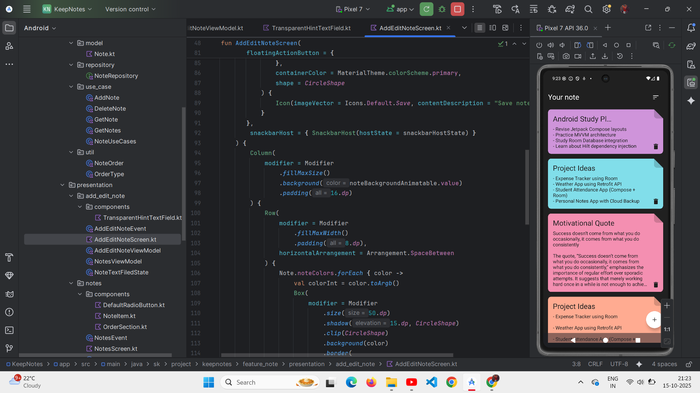
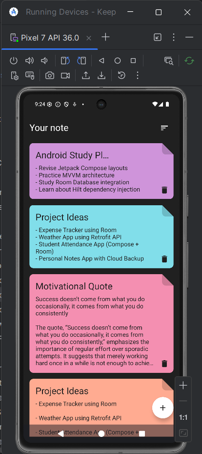
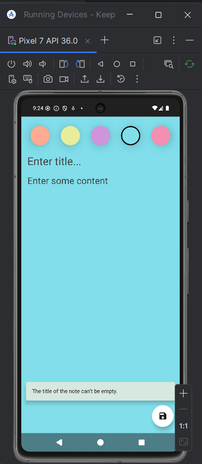
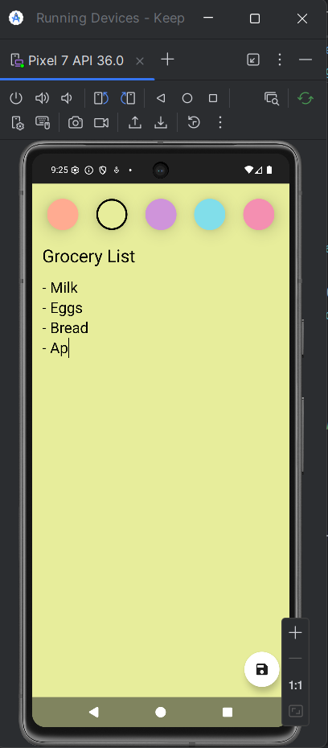
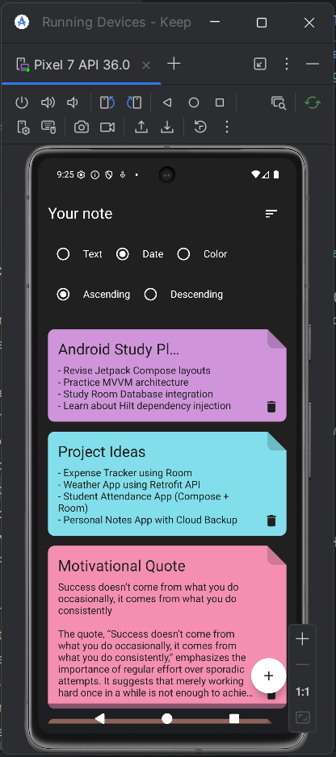

<h1 align="center">📚 KeepNotes – Personal Note App</h1>

  
  
  

---

## 📱 Overview

**KeepNotes** is a modern **Note-Taking App** built with **Kotlin**, **Jetpack Compose**, and **MVVM architecture**.  
It allows users to create, edit, delete, and organize notes with customizable colors and smooth animations.  
The app follows **Clean Architecture principles**, inspired by *Philipp Lackner’s “Clean Architecture Note App”*.

---

## ✨ Features

<ul>
  <li>📝 Add, Edit & Delete Notes</li>
  <li>🎨 Customizable Note Colors</li>
  <li>🧠 Clean Architecture (MVVM + Use Cases + Repository Pattern)</li>
  <li>💾 Local Database using Room</li>
  <li>🔍 Sort Notes by Title, Date, or Color</li>
  <li>🔄 Ascending / Descending Order Sorting</li>
  <li>⚡ Compose UI with State Management using ViewModel</li>
  <li>📱 Modern & Responsive UI using Jetpack Compose</li>
</ul>

---

## 🧩 Tech Stack

| **Layer** | **Technologies Used** |
|------------|-----------------------|
| UI Layer | Jetpack Compose, Material 3 Components |
| Architecture | MVVM + Clean Architecture |
| Data Layer | Room Database, DAO, Repository |
| Domain Layer | Kotlin Coroutines, Use Cases |
| Dependency Injection | Hilt |
| Language | Kotlin |

---

## 🧠 Architecture Overview

This app follows **Clean Architecture**:

- **Presentation Layer** – UI built with Jetpack Compose and ViewModels.  
- **Domain Layer** – Contains business logic in use cases.  
- **Data Layer** – Manages Room database and repository operations.  

This ensures **scalability**, **testability**, and **clean code**.

---

## 📸 Screenshots

### 🏠 Main Notes Screen  
Displays all saved notes with sorting and color tags.  

  

  <em>
    The main screen displays all saved notes with their respective colors and titles.  
    Sorting options allow quick arrangement by title, date, or color.
  </em>

---

| Add Note Screen | Empty Title Validation | Updated Notes List | Code Preview |
|:----------------:|:----------------------:|:-------------------:|:-------------:|
|  |  |  |  |
| 🖊️ Create notes with color selection | ⚠️ Warning when title is empty | 📋 Notes displayed after new additions | 💻 Project running inside Android Studio emulator |

---

## 🙌 Acknowledgment

This project takes architectural inspiration from  
**Philipp Lackner’s Clean Architecture Note App** tutorial.  
Special thanks to the open-source Android community for great learning resources.

---

  © 2025 KeepNotes Project by <strong>Siddhant Kudale</strong> 
  <em>Built with ❤️ using Kotlin & Jetpack Compose</em>

